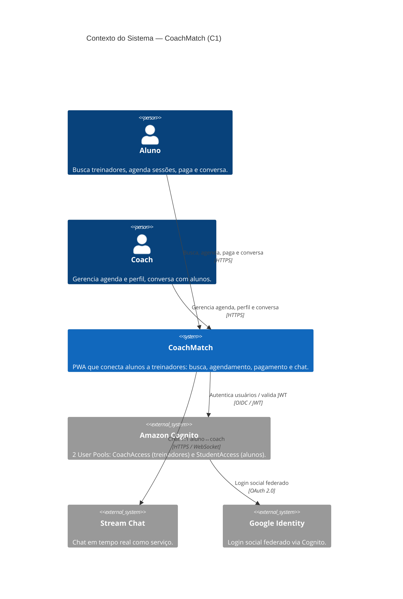
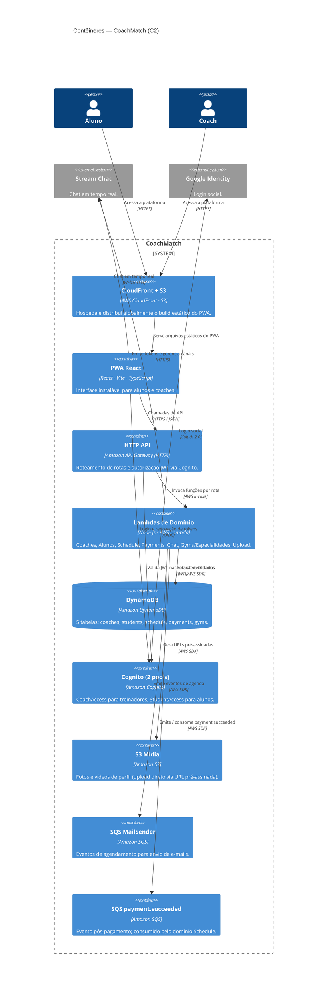

# Arquitetura do CoachMatch

Visão geral de como as peças do sistema se conectam. O modelo completo está em [`docs/c4/workspace.dsl`](../c4/workspace.dsl) (Structurizr DSL) — veja o [README da raiz](../../README.md) para instruções de como visualizá-lo localmente.

## Diagrama de Contexto (C1)

CoachMatch e os sistemas com que se integra.

## Diagrama de Contêineres (C2)

Os principais componentes de execução do sistema.

> **Não implantados:** Validador CREF-SP e Agendador CREF estão modelados no DSL mas não foram entregues (ver SCRUM-5). O Gateway de Pagamento externo também está modelado mas ainda não integrado — o domínio `payments` usa cartões e PIX simulados.

## Componentes por domínio

| Domínio | Código em | Lambda(s) | Tabela DynamoDB |
| --- | --- | --- | --- |
| **Coaches** | `src/coaches/` | `coachGetMe`, `coachUpdateMe`, `coachCreate` (Cognito Trigger) | `coaches` |
| **Alunos** | `src/students/` | `studentGetProfile`, `studentUpdateProfile`, `studentUpdateHealth`, `studentCreate` (Cognito Trigger) | `students` |
| **Academias** | `src/gyms/` | `getGyms`, `postGymsSuggest` | `gyms` |
| **Especialidades** | `src/specialties/` | `getSpecialties` | `specialties` |
| **Agendamentos** | `src/schedule/` | `getCoachSchedule`, `postCoachSchedule`, `postScheduleRequest`, `postApproveSchedule`, `postCancelSchedule`, `postClassStatus`, `on-payment-succeeded` | `schedule` |
| **Pagamentos** | `src/payments/` | `createPayment`, `getPayment`, `refundPayment` | `payments` |
| **Chat** | `src/api-chat/` | `chatToken`, `chatConversationCreate`, `chatConversationList`, `chatMessageSend`, `chatMessageList` (e outros) | — (Stream Chat) |
| **Upload** | `src/upload/` | `generateUploadUrl` | — (S3) |

**Nota sobre o chat:** diferente dos outros domínios, `api-chat` não persiste dados no DynamoDB — delega tudo ao Stream Chat. Ver [Fluxo de chat](chat-workflow.md).

## Fluxos de domínio

| Domínio | Documento |
| --- | --- |
| Agendamentos | [schedule-workflow.md](schedule-workflow.md) |
| Pagamentos | [payments-workflow.md](payments-workflow.md) |
| Chat | [chat-workflow.md](chat-workflow.md) |

## Decisões de arquitetura (ADRs)

| ADR | Decisão |
| --- | --- |
| [0001](../ADRs/0001-adocao-de-arquitetura-serverless-na-aws.md) | Adoção de arquitetura serverless na AWS |
