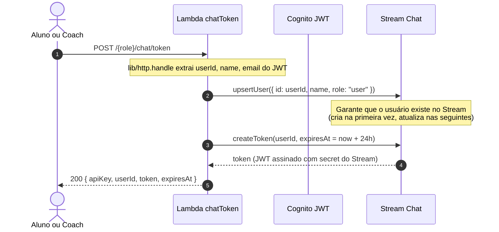
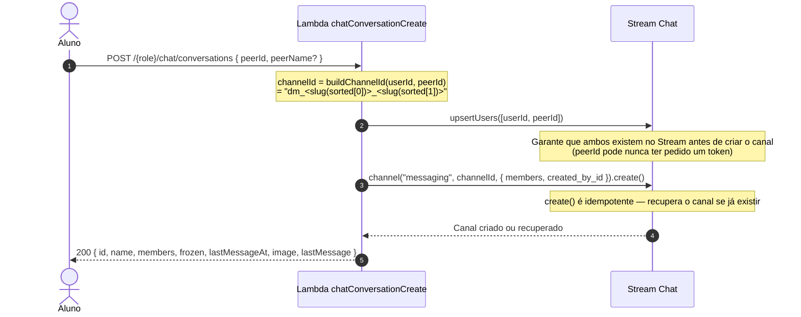
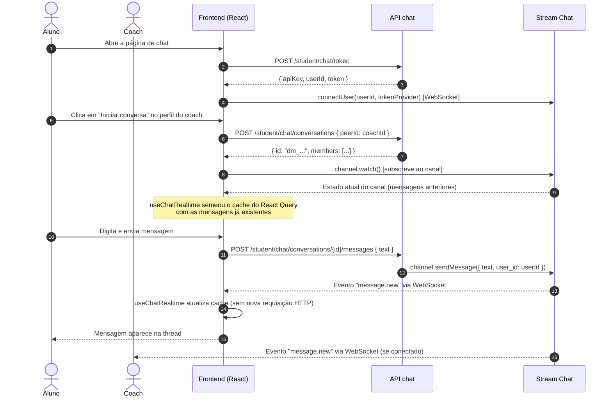

# Fluxo de chat (`api-chat`)

Como funciona o domínio `api-chat` (`server/coachmatch/src/api-chat/`): quem são os atores, como o token de acesso é emitido, como uma conversa é criada e como o frontend mantém mensagens em tempo real.

> **Chat é a exceção arquitetural.** Diferente das Lambdas de 3 camadas + DynamoDB, `api-chat` não persiste nada localmente: delega tudo ao **Stream Chat** via `shared/streamClient.js`. O handler é fino (`lib/http.handle` resolve o usuário das claims do Cognito e mapeia erros → status), a regra fica em `service/` e a posse de canal/mensagem é checada em `lib/membership.js`.

## Atores

| Ator | Papel no fluxo |
| --- | --- |
| **Aluno** | Inicia uma conversa com um coach, envia e lê mensagens. Acessa via `/student/chat/*`. |
| **Coach** | Responde a conversas iniciadas por alunos, envia e lê mensagens. Acessa via `/coach/chat/*`. |
| **API `api-chat`** | Lambdas que autenticam via Cognito JWT, emitem tokens do Stream e delegam operações ao SDK server-side do Stream. |
| **Stream Chat** | Serviço externo (getstream.io). Persiste canais, mensagens e membros. Entrega eventos em tempo real via WebSocket para o cliente. |
| **`shared/streamClient.js`** | Singleton do SDK server-side do Stream, usado pelas Lambdas como admin (sem restrições de permissão do Stream). |

Cada rota existe sob `/coach/chat/*` (authorizer CoachAccess) e `/student/chat/*` (authorizer StudentAccess). A mesma Lambda atende os dois papéis.

## Emissão de token (TTL 24h)

O frontend precisa de um token do Stream para abrir a conexão WebSocket. Esse token é emitido pelo backend a cada sessão.

O token expira em **24 horas**. O frontend usa um `tokenProvider` para renová-lo automaticamente sem reconectar o WebSocket (`src/lib/streamChat.ts`).

## Criação de canal direto

Um canal de mensagens diretas (tipo `messaging`) é identificado por um `channelId` determinístico derivado dos dois participantes — independe de quem cria primeiro.

**`buildChannelId`**: ordena os dois UUIDs alfabeticamente e concatena os primeiros 8 hex de cada um (`dm_<8chars>_<8chars>`). A ordenação garante que `buildChannelId(A, B) === buildChannelId(B, A)`.

## Checagem de membro (`lib/membership.js`)

O SDK server-side do Stream opera como admin e ignora as permissões internas do Stream. A autorização é responsabilidade do backend.

`assertMembership(stream, channelId, userId)` carrega o estado do canal e verifica se `userId` está em `channel.state.members`. Se o canal não existe → 404. Se o usuário não é membro → 403.

Toda operação de escrita (update, delete, enviar/editar/apagar mensagem) chama `assertMembership` antes de agir. A listagem de mensagens também valida antes de expor o histórico.

## O que fica no Stream vs no CoachMatch

| Dado | Onde fica | Justificativa |
| --- | --- | --- |
| Mensagens (texto, deleted_at) | **Stream** | Stream é a fonte da verdade do histórico |
| Canais (membros, frozen, last_message_at) | **Stream** | Gerenciado pelo SDK |
| Nome da conversa (`name`) | **Stream** (campo `data.name` do canal) | Metadata do canal |
| Imagem do par (`image`) | **CoachMatch** (consultada por requisição) | Resolução dinâmica via `lib/profiles.js`; varia por quem olha |
| Tokens de acesso | **não persistidos** | Gerados on-the-fly, TTL 24h |
| Histórico de usuários | **Stream** (`upsertUser`) | Somente id + nome; dados detalhados ficam nas tabelas `coaches`/`students` |

## Fluxo completo de uma troca de mensagens

## Como o frontend consome (`useChat`, `useChatRealtime`)

Definidos em `client/src/hooks/useChat.ts` e `client/src/lib/streamChat.ts`.

### Estratégia de dados: REST + realtime opcional

O frontend usa dois caminhos complementares:

| Situação | Estratégia |
| --- | --- |
| Listar conversas | React Query + polling a cada **15s** |
| Carregar mensagens iniciais | React Query + polling a cada **5s** (fallback) |
| Mensagens em tempo real | WebSocket do Stream (substitui o polling quando conectado) |

### `useChatRealtime`

Chama `getChatClient(role)` → abre conexão WebSocket com o Stream → chama `channel.watch()` → semeia o cache do React Query com o estado atual do canal → subscreve a `message.new`, `message.updated` e `message.deleted`.

Quando `connected = true`, o polling de mensagens é desligado (o hook passa `refetchInterval: false`). Se a conexão não estiver disponível (ambiente de teste, falha de rede, `MODE === "test"`), `getChatClient` devolve `null` e a UI cai silenciosamente no polling REST.

### `getChatClient` (singleton)

- Mantém uma única conexão aberta por papel (`role`). Troca de papel (coach↔aluno) desconecta o usuário anterior antes de conectar o novo.
- Usa `tokenProvider` para renovar o token em background quando o TTL expirar — sem reconectar.
- Em `MODE === "test"` retorna `null` imediatamente para manter os testes determinísticos.

### `serializeStreamMessage`

Converte uma mensagem do Stream (formato SDK) para o formato `ChatMessage` exposto pela API REST, garantindo que ambos os caminhos (REST e WebSocket) produzam o mesmo formato no cache.

Contratos completos (payload, campos obrigatórios, códigos de erro): coleção Postman em `docs/postman_collection/` e os testes em `server/coachmatch/src/api-chat/__tests__/`.
