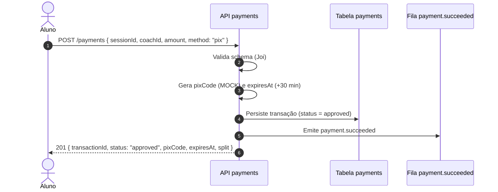
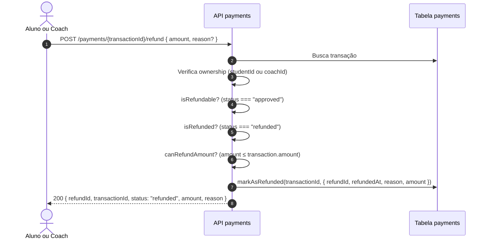
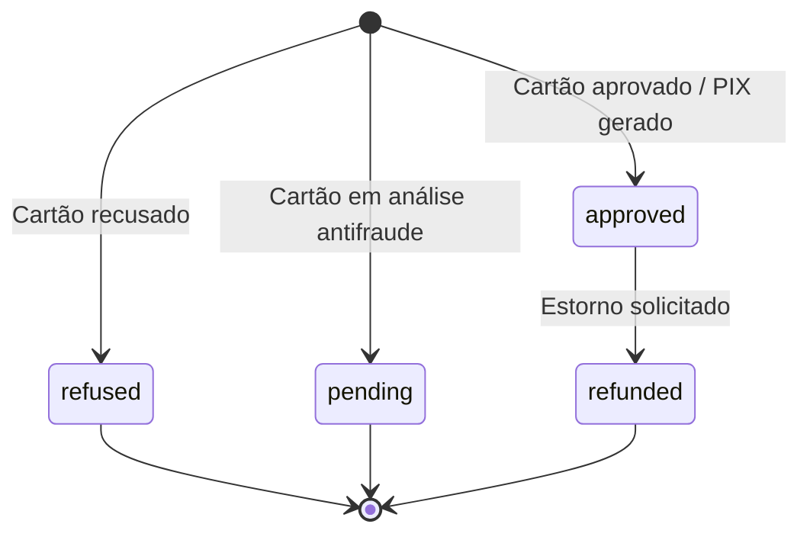

# Fluxo de pagamentos (`payments`)

Como funciona o domínio `payments` (`server/coachmatch/src/payments/`): quem são os atores, em que ordem eles agem, como o estado de uma transação evolui e como o evento de pagamento se conecta ao domínio de agendamento.

## Atores

| Ator | Papel no fluxo |
| --- | --- |
| **Aluno** | Inicia o pagamento (cartão ou PIX) para uma sessão já reservada. Pode solicitar estorno de uma transação aprovada. |
| **Coach** | Pode solicitar estorno de uma transação da qual é parte (cobrança indevida, cancelamento acordado). |
| **API `payments`** | As Lambdas do domínio. Validam o payload, resolvem o cenário de pagamento, gravam no DynamoDB e emitem o evento `payment.succeeded`. |
| **Tabela `payments`** | Fonte da verdade das transações. Um item por transação; GSIs permitem consulta por coach, aluno ou sessão. |
| **Fila `payment.succeeded` (SQS)** | Recebe o evento após cada transação aprovada. Desacopla o domínio de pagamentos do domínio de agendamento. |
| **Consumidor `on-payment-succeeded`** | Lambda no domínio `schedule`. Lê o evento SQS e marca o agendamento como pago (`paymentStatus = PAID`). |

## Caminho feliz — pagamento por cartão

```mermaid
sequenceDiagram
    autonumber
    actor Aluno
    participant API as API payments
    participant DB as Tabela payments
    participant SQS as Fila payment.succeeded
    participant Sched as Lambda on-payment-succeeded
    participant SchedDB as Tabela schedule

    Aluno->>API: POST /payments { sessionId, coachId, amount, card }
    Note over API: studentId vem do JWT, não do body
    API->>API: Valida schema (Joi)
    API->>API: resolveCardScenario(card.number) → status
    API->>API: calculateSplit(amount) → platformFee / coachAmount
    API->>DB: Persiste transação (status = approved)
    API->>SQS: Emite payment.succeeded (fire-and-forget; falha apenas logada)
    API-->>Aluno: 201 { transactionId, status: "approved", split, cardLastFour, ... }

    SQS->>Sched: payment.succeeded { sessionId, transactionId, studentId, ... }
    Sched->>SchedDB: UPDATE paymentStatus = PAID<br/>WHERE status = BOOKED AND studentId = :student
    Note over Sched: ConditionalCheckFailed → descarta silenciosamente
```

Dois pontos importantes que o diagrama revela:

- `studentId` nunca vem do body — é extraído do JWT pelo authorizer. Isso impede que um aluno pague em nome de outro.
- A emissão do evento é "best-effort": a transação já foi persistida antes. Se o SQS falhar, o `paymentStatus` do schedule fica `PENDING` e precisa de correção manual. Está documentado como dual-write conhecido em `src/payments/create-payment/index.js`.

## Caminho feliz — pagamento por PIX



PIX é sempre aprovado imediatamente no simulador. Em produção, o `pixCode` viria do gateway real e `status` poderia ser `pending` até a confirmação.

## Estorno



Regras do estorno:

- Só o aluno ou o coach da transação pode solicitá-lo — qualquer outro recebe 403.
- Só transações `approved` podem ser estornadas (`refused`, `pending` → 400).
- Estorno parcial é permitido: `amount` pode ser menor que `transaction.amount`, mas nunca maior.
- Não existe reeemissão do evento de pagamento no estorno — o `paymentStatus` do schedule não é revertido automaticamente.

## Estado da transação



`pending` é terminal no simulador. Em produção, um webhook do gateway poderia transitá-lo para `approved` ou `refused`.

## Modelo da tabela `payments`

Um item por transação. Chaves e GSIs definidos em `src/payments/create-payment/repository.js`.

| Chave | Valor | Padrão de acesso |
| --- | --- | --- |
| `PK` | `TRANSACTION#<transactionId>` | Busca direta por ID (`GET /payments/{transactionId}`) |
| `SK` | `METADATA` | (sempre fixo) |
| `GSI1PK` | `COACH#<coachId>` | Histórico de transações do coach (`GET /payments/coach/{coachId}`) |
| `GSI1SK` | `TRANSACTION#<createdAt>` | Ordena por data de criação |
| `GSI2PK` | `STUDENT#<studentId>` | Histórico de transações do aluno (`GET /payments/student/{studentId}`) |
| `GSI2SK` | `TRANSACTION#<createdAt>` | Ordena por data de criação |
| `GSI3PK` | `SESSION#<sessionId>` | Transações de uma sessão específica (`GET /payments/session/{sessionId}`) |
| `GSI3SK` | `TRANSACTION#<transactionId>` | Desempate por ID |

**Campos do item:**

| Campo | Tipo | Descrição |
| --- | --- | --- |
| `transactionId` | string | `txn_<uuid>` |
| `sessionId` | string | Referência opaca ao recurso pago (ex.: `scheduleId`). O domínio de payments não conhece o formato. |
| `coachId` | UUID | Coach da sessão |
| `studentId` | UUID | Aluno que pagou (extraído do JWT) |
| `method` | `credit_card` \| `pix` | Método de pagamento |
| `amount` | integer | Valor em centavos |
| `status` | `approved` \| `refused` \| `pending` \| `refunded` | Estado atual |
| `split` | `{ platformFee, coachAmount }` | Divisão do valor (10% plataforma / 90% coach). Ausente se `refused`. |
| `cardLastFour` | string | Últimos 4 dígitos (cartão) |
| `pixCode` | string | Código PIX gerado (PIX) |
| `expiresAt` | ISO 8601 | Expiração do código PIX (+30 min) |
| `refusalReason` | string? | Motivo da recusa |
| `requires3ds` | boolean? | Cartão exige autenticação 3-D Secure |
| `createdAt` | ISO 8601 | Data de criação |
| `updatedAt` | ISO 8601 | Última atualização |

## Evento `payment.succeeded` e consumidor

**Emissor:** `src/shared/events.js` — chamado por `create-payment` após persistir a transação.

**Payload do evento:**

```json
{
  "event": "payment.succeeded",
  "sessionId": "<scheduleId>",
  "transactionId": "txn_<uuid>",
  "studentId": "<uuid>",
  "coachId": "<uuid>",
  "amount": 18000,
  "status": "approved",
  "createdAt": "2025-05-15T14:00:00.000Z"
}
```

**Consumidor:** `src/schedule/on-payment-succeeded/handler.js`

- Recebe o evento do SQS e interpreta `sessionId` como `scheduleId`.
- Grava `paymentStatus = PAID` e `paymentTransactionId` no schedule **apenas se** `status = BOOKED` e `studentId` bate. Pagamento de aluno errado ou schedule já cancelado é descartado silenciosamente (log `WARN`).
- Usa "partial batch response": falhas transitórias (throttle, timeout) devolvem o item ao SQS para reprocessamento; falhas permanentes (condição não atendida) são descartadas.
- Em ambiente local (`PAYMENT_SUCCEEDED_QUEUE_URL` ausente) a emissão vira no-op.

## Cartões e cenários de teste

Definidos em `src/payments/shared/config.js`. Em produção, o cenário viria do gateway real.

| Número do cartão | Status | Motivo |
| --- | --- | --- |
| `4111 1111 1111 1111` | `approved` | — |
| `4222 2222 2222 2222` | `refused` | Limite ou saldo insuficiente |
| `4333 3333 3333 3333` | `pending` | Pagamento em análise antifraude |
| `4444 4444 4444 4441` | `approved` | Exige 3-D Secure |
| `4555 5555 5555 5557` | `refused` | Cartão expirado |
| `4666 6666 6666 6669` | `refused` | CVV inválido |
| `4777 7777 7777 7770` | `refused` | Cartão bloqueado ou cancelado |
| Qualquer outro número | `approved` | Default |

Para testar PIX, envie `method: "pix"` sem o campo `card` — sempre resulta em `approved`.

Contratos completos (payload, campos obrigatórios, códigos de erro): coleção Postman em `docs/postman_collection/` e os testes em `server/coachmatch/src/payments/__tests__/`.
