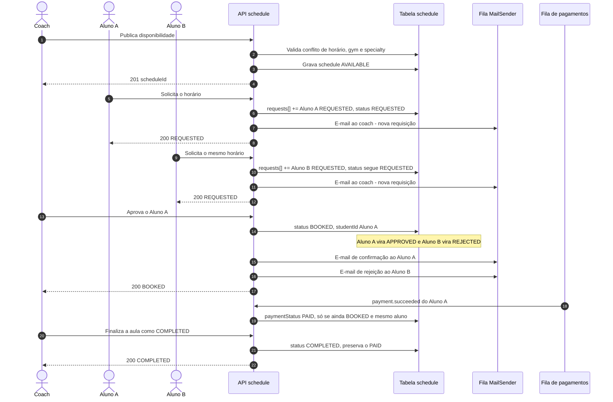
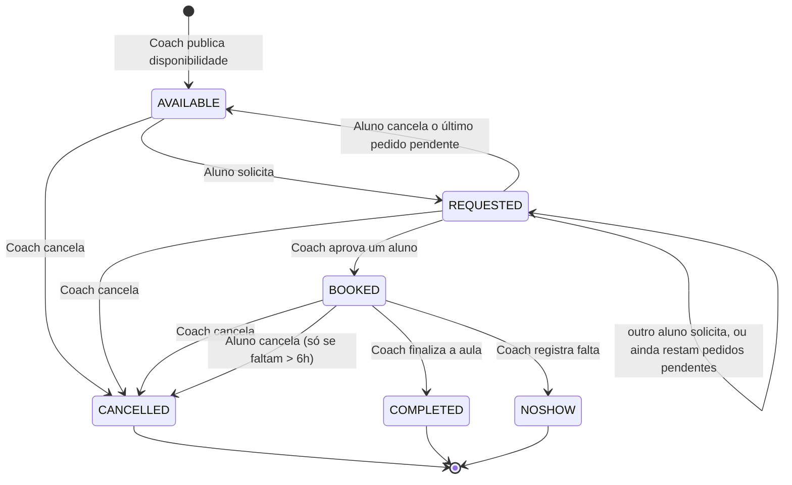
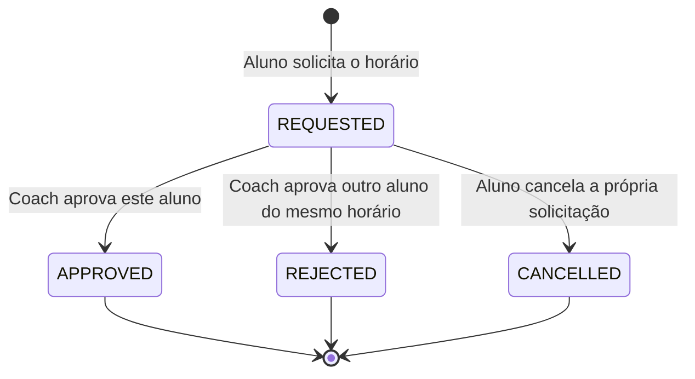

# Fluxo de agendamento (`schedule`)

Como funciona o domínio `schedule` (`server/coachmatch/src/schedule/`): quem são os atores, em que ordem eles agem e como o estado de um horário evolui.

## Atores

| Ator | Papel no fluxo |
| --- | --- |
| **Coach** | Publica disponibilidades, aprova um dos alunos interessados, cancela horários e finaliza a aula como `COMPLETED`/`NOSHOW`. |
| **Aluno** | Solicita um horário disponível, cancela a própria solicitação e cancela uma aula já reservada (com no mínimo 6h de antecedência). |
| **API `schedule`** | As Lambdas do domínio. Validam ownership e estado, gravam no DynamoDB e disparam as notificações. |
| **Tabela `schedule`** | Fonte da verdade do horário. Um único item guarda o horário e o array `requests[]` com todos os interessados. |
| **Tabelas de apoio** | `coaches`, `student`, `gyms`, `specialties` — usadas para validar referências e buscar nome/e-mail dos destinatários das notificações. |
| **Fila MailSender (SQS)** | Recebe os e-mails a enviar. Serviço externo ao domínio. |
| **Fila de pagamentos (SQS)** | Entrega `payment.succeeded` ao consumidor `on-payment-succeeded`, que marca o horário como pago. O pagamento em si acontece fora deste domínio. |

Dois estados independentes compõem o domínio:

- **`schedule.status`** — o horário em si (disponível, solicitado, reservado, cancelado, finalizado).
- **status de cada item em `schedule.requests[]`** — o pedido de um aluno específico para aquele horário.

Um horário com três interessados tem `status = REQUESTED` **uma vez** e três entradas em `requests[]`, cada uma com seu próprio status.

## Caminho feliz — da publicação à aula concluída



Pontos que a ordem acima já revela:

- A resposta ao aluno sai **depois** da gravação, mas o e-mail é assíncrono — falha ao enfileirar é apenas logada, nunca derruba a requisição.
- Aprovar decide **todos** os pedidos pendentes de uma vez: um `APPROVED`, o resto `REJECTED`. Pedidos já `CANCELLED`/`REJECTED` ficam como estão e seus alunos não recebem aviso.
- `paymentStatus` é escrito por dois fluxos. `on-payment-succeeded` grava `PAID` (aluno pagou); finalizar a aula grava `PENDING` (repasse ao coach pendente) **apenas se ainda não houver `PAID`**. `PAID` sempre vence.

## Cancelamentos

Três atores cancelam coisas diferentes, com consequências diferentes.

```mermaid
sequenceDiagram
    autonumber
    actor Aluno
    actor Coach
    participant API as API schedule
    participant DB as Tabela schedule
    participant Mail as Fila MailSender

    Note over Aluno,Mail: Aluno desiste da solicitação (schedule ainda AVAILABLE ou REQUESTED)
    Aluno->>API: Cancela a própria solicitação
    API->>DB: Lê o schedule
    API->>DB: Pedido do aluno vira CANCELLED
    Note over API,DB: status volta a AVAILABLE se não sobrar nenhum pedido REQUESTED, senão segue REQUESTED
    API-->>Aluno: 200 - sem notificação
    end

    Note over Aluno,Mail: Coach cancela o horário (AVAILABLE, REQUESTED ou BOOKED)
    Coach->>API: Cancela o horário
    API->>DB: status CANCELLED
    alt estava BOOKED
        API->>Mail: E-mail ao aluno reservado
    else estava AVAILABLE ou REQUESTED
        API->>Mail: E-mail a cada aluno com pedido REQUESTED
    end
    API-->>Coach: 200 CANCELLED com notifiedStudents
    end

    Note over Aluno,Mail: Aluno cancela a aula já reservada
    Aluno->>API: Cancela a aula BOOKED
    API->>DB: Lê o schedule
    Note over API: Checa nesta ordem - status BOOKED, ownership, startDateTime legível, janela de 6h
    API->>DB: status CANCELLED
    API->>Mail: E-mail ao coach
    API-->>Aluno: 200 CANCELLED
    end
```

Regras que valem a pena fixar:

- O aluno só cancela uma aula reservada se faltarem **mais de 6 horas** para o início. Um `startDateTime` ilegível é recusado com 422 em vez de escapar da janela.
- Nessa rota — e só nela — a checagem de estado (422) vem **antes** da de ownership (403). Nas demais escritas do domínio a ordem é a inversa.
- Cancelar uma solicitação não notifica ninguém; cancelar um horário sempre notifica quem estava esperando por ele.
- `CANCELLED`, `COMPLETED` e `NOSHOW` são terminais. Não existe transição de saída.

## Estado do horário (`schedule.status`)



Condições que o diagrama não mostra:

- Aprovar exige `schedule.status = REQUESTED` **e** que o pedido do aluno indicado ainda esteja `REQUESTED`. Sem isso seria possível agendar para quem já desistiu ou ressuscitar um horário cancelado.

## Estado de cada pedido (`requests[]`)



Um aluno só pode ter **um** pedido ativo por horário: uma nova solicitação remove qualquer pedido anterior do mesmo aluno antes de dar append em `requests[]`. Pedidos decididos (`APPROVED`/`REJECTED`/`CANCELLED`) permanecem no array como histórico.

## Concorrência e consistência

- Toda escrita em `requests[]` é condicionada ao valor lido. Duas solicitações simultâneas no mesmo horário não se sobrescrevem: a perdedora recebe **409** e pode repetir.
- Leituras que varrem a tabela seguem `LastEvaluatedKey`, então nenhuma página é omitida silenciosamente.

Contratos completos (payload, campos obrigatórios, códigos de erro): coleção Postman em `docs/postman_collection/` e os testes em `server/coachmatch/src/schedule/__tests__/`.
